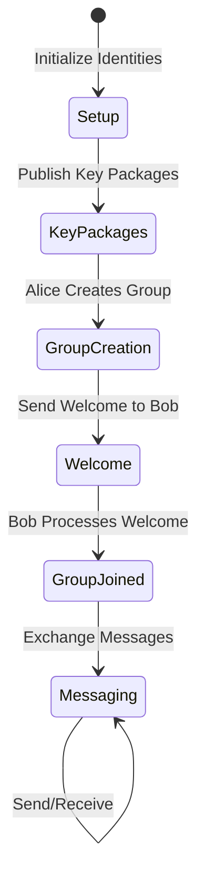

# NIP-EE MLS Visual Explainer Plan

## Overview

Build an interactive visual explainer for the NIP-EE (Nostr Implementation Possibilities - End-to-End Encryption) MLS protocol using React and WASM-compiled Zig library. The visualizer will demonstrate the complete flow of MLS group messaging between Alice and Bob, from key package publication to secure message exchange.

## Architecture

### 1. WASM Integration

Build the Zig Nostr library as WASM module with exported functions:
- `createKeyPackage(identity: Identity): KeyPackage`
- `createGroup(creator: Identity, members: KeyPackage[]): GroupCreationResult`
- `processWelcome(identity: Identity, welcome: Welcome): GroupState`
- `sendMessage(state: GroupState, message: string): GroupMessage`
- `receiveMessage(state: GroupState, message: GroupMessage): DecryptedMessage`

WASM build configuration:
```zig
// build.zig addition
const wasm_lib = b.addSharedLibrary(.{
    .name = "nostr_mls",
    .root_source_file = b.path("src/wasm_exports.zig"),
    .target = b.resolveTargetQuery(.{
        .cpu_arch = .wasm32,
        .os_tag = .freestanding,
    }),
    .optimize = .ReleaseSmall,
});
wasm_lib.export_memory = true;
wasm_lib.import_memory = false;
```

### 2. Component Architecture

```
App.tsx
├── MLSVisualizer.tsx (main container)
│   ├── ParticipantPanel.tsx (Alice/Bob controls)
│   │   ├── IdentityCard.tsx
│   │   ├── KeyPackageManager.tsx
│   │   └── MessageComposer.tsx
│   ├── ProtocolFlow.tsx (center visualization)
│   │   ├── StateTransitionDiagram.tsx (mermaid)
│   │   ├── EventTimeline.tsx
│   │   └── MessageFlow.tsx
│   └── NostrEventViewer.tsx (raw event display)
└── WasmProvider.tsx (WASM context)
```

### 3. Visual Flow States



### 4. UI Components

#### ParticipantPanel (Split Screen)
- **Left**: Alice's interface
- **Right**: Bob's interface
- Each side shows:
  - Identity info (pubkey, nickname)
  - Key package status
  - Group membership
  - Message history
  - Action buttons

#### ProtocolFlow (Center)
- Timeline of events with animations
- Visual representation of:
  - Key package publication (Kind 443)
  - Welcome message (Kind 444)
  - Group messages (Kind 445)
- Arrows showing data flow
- Encrypted vs decrypted states

#### Interactive Features
1. **Step-by-step mode**: Progress through protocol manually
2. **Auto-play mode**: Animated walkthrough
3. **Event inspection**: Click to view raw Nostr events
4. **State viewer**: Display current MLS group state

### 5. Implementation Steps

#### Phase 1: WASM Setup
1. Create `wasm_exports.zig` with C-compatible exports
2. Build system configuration for WASM target
3. JavaScript bindings and TypeScript types
4. WASM loader component in React

#### Phase 2: Core Components
1. Identity management (keypair generation)
2. Key package creation and display
3. Group creation interface
4. Welcome message handling
5. Message encryption/decryption UI

#### Phase 3: Visualization
1. Mermaid diagram integration
2. Event timeline component
3. Message flow animations
4. State transition effects

#### Phase 4: Polish
1. Responsive design
2. Dark mode support
3. Export/import scenarios
4. Error handling and edge cases

### 6. Data Structures

```typescript
interface Identity {
  privateKey: Uint8Array;
  publicKey: Uint8Array;
  nickname: string;
}

interface MLSState {
  identity: Identity;
  keyPackage?: KeyPackage;
  groups: Map<string, GroupState>;
  events: NostrEvent[];
}

interface VisualizerState {
  alice: MLSState;
  bob: MLSState;
  currentStep: ProtocolStep;
  eventHistory: VisualizationEvent[];
}
```

### 7. Key Visualizations

1. **Key Package Display**: Show as a "sealed envelope" with metadata
2. **Welcome Message**: Animated envelope delivery from Alice to Bob
3. **Group State**: Tree diagram showing group members
4. **Message Encryption**: Visual transformation from plaintext to ciphertext
5. **Nostr Events**: Color-coded by type with expandable details

### 8. Educational Features

- Hover tooltips explaining each protocol step
- Glossary sidebar for MLS/Nostr terms
- "Why is this secure?" explanations
- Code snippets showing actual API usage

### 9. Development Priorities

1. **MVP**: Basic Alice/Bob flow with manual steps
2. **Enhanced**: Animations and state visualization
3. **Advanced**: Multiple members, key rotation, error scenarios

### 10. Technical Considerations

- Use React Context for WASM instance
- Mermaid for state diagrams (react-mermaid2)
- Framer Motion for animations
- Tailwind CSS for styling
- Local storage for persisting scenarios